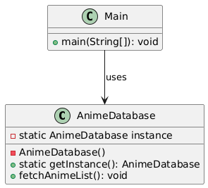
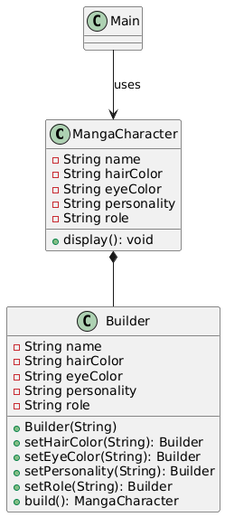
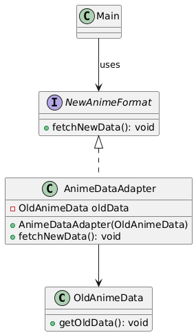
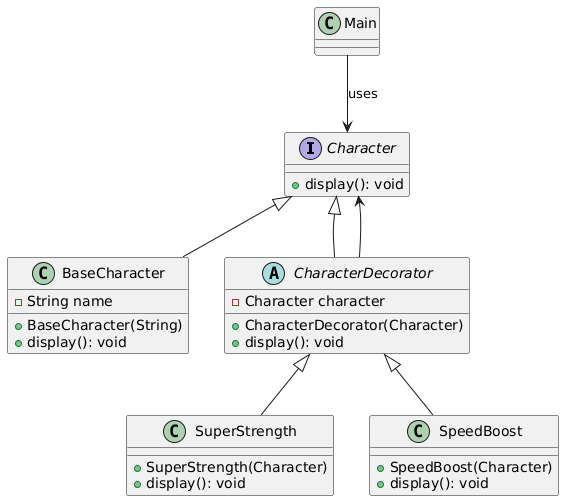
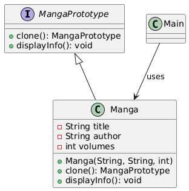
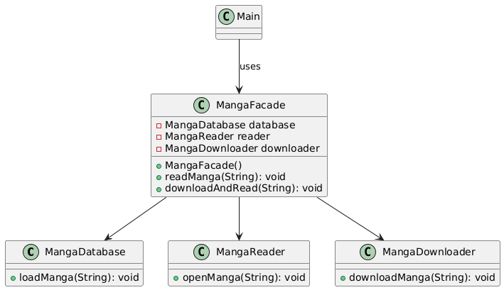
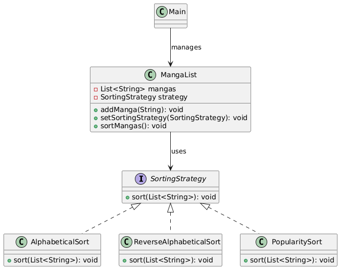
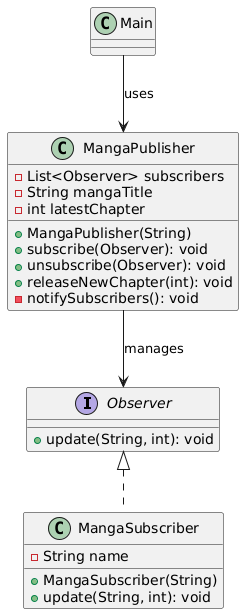
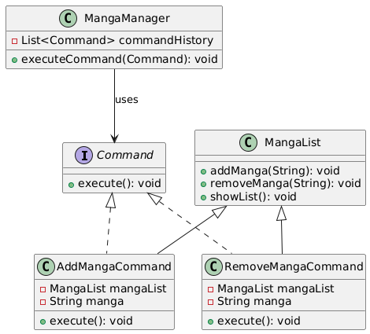
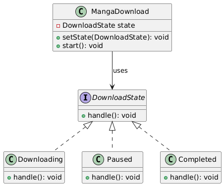

Лабораторная работа №6
---
___Тема:___ Использование шаблонов проектирования
___Цель работы:___ Получить опыт применения шаблонов проектирования при написании кода программной системы.

Шаблоны проектирования GoF
---
___Порождающие шаблоны___
1. Factory Method (Фабричный метод)
   **Описание:** Этот шаблон определяет общий интерфейс для создания объектов, но делегирует выбор конкретного класса подклассам. Это позволяет клиентскому коду работать с абстракцией, не зная деталей реализации создаваемых объектов. Фабричный метод полезен, когда необходимо снизить зависимость кода от конкретных классов и обеспечить лёгкость в расширении системы.
   ___Код на Python___
   ```
    // Factory Method — Фабрика персонажей аниме

    abstract class AnimeCharacter {
        protected String name;

        public AnimeCharacter(String name) {
            this.name = name;
        }

        abstract void displayInfo();
    }

    class ShonenHero extends AnimeCharacter {
        public ShonenHero(String name) {
            super(name);
        }

        @Override
        void displayInfo() {
            System.out.println(name + " — главный герой сенэн-аниме!");
        }
    }

    class ShoujoHeroine extends AnimeCharacter {
        public ShoujoHeroine(String name) {
            super(name);
        }

        @Override
        void displayInfo() {
            System.out.println(name + " — главная героиня сёдзё-аниме!");
        }
    }

    abstract class AnimeCharacterFactory {
        public abstract AnimeCharacter createCharacter(String name);
    }

    class ShonenFactory extends AnimeCharacterFactory {
        @Override
        public AnimeCharacter createCharacter(String name) {
            return new ShonenHero(name);
        }
    }

    class ShoujoFactory extends AnimeCharacterFactory {
        @Override
        public AnimeCharacter createCharacter(String name) {
            return new ShoujoHeroine(name);
        }
    }

    // Использование
    public class Main {
        public static void main(String[] args) {
            AnimeCharacterFactory shonenFactory = new ShonenFactory();
            AnimeCharacterFactory shoujoFactory = new ShoujoFactory();

            AnimeCharacter hero = shonenFactory.createCharacter("Наруто");
            AnimeCharacter heroine = shoujoFactory.createCharacter("Усаги");

            hero.displayInfo();
            heroine.displayInfo();
        }
    }
   ```
    ___UML-диаграмма___
    

2. Singleton (Одиночка)
   **Описание:** Гарантирует, что у класса есть только один экземпляр, к которому можно получить глобальный доступ. Это полезно в случаях, когда необходимо централизованное управление ресурсами, например, подключение к базе данных или логирование. Одиночка предотвращает создание нескольких экземпляров, что может привести к нежелательным последствиям, таким как дублирование данных или утечка ресурсов.
   ___Код на Python___
   ```
    // Singleton — Менеджер базы данных аниме
    public class AnimeDatabase {
        private static AnimeDatabase instance;
        
        private AnimeDatabase() {
            System.out.println("Подключение к базе данных аниме...");
        }
        
        public static AnimeDatabase getInstance() {
            if (instance == null) {
                instance = new AnimeDatabase();
            }
            return instance;
        }
        
        public void fetchAnimeList() {
            System.out.println("Загрузка списка аниме...");
        }
    }

    // Использование
    public class Main {
        public static void main(String[] args) {
            AnimeDatabase db1 = AnimeDatabase.getInstance();
            db1.fetchAnimeList();

            AnimeDatabase db2 = AnimeDatabase.getInstance();
            System.out.println(db1 == db2); // true
        }
    }
   ```
    ___UML-диаграмма___
    

3. Builder (Строитель)
   **Описание:** Позволяет создавать сложные объекты пошагово, скрывая детали их построения. Этот шаблон удобен, когда объект имеет множество опциональных параметров или сложную структуру. В отличие от конструктора, строитель делает код более читаемым и удобным для расширения.
   ___Код на Python___
   ```
    class MangaCharacter {
        private String name;
        private String hairColor;
        private String eyeColor;
        private String personality;
        private String role;

        private MangaCharacter(Builder builder) {
            this.name = builder.name;
            this.hairColor = builder.hairColor;
            this.eyeColor = builder.eyeColor;
            this.personality = builder.personality;
            this.role = builder.role;
        }

        public void display() {
            System.out.println("Персонаж манги: " + name);
            System.out.println("Цвет волос: " + hairColor);
            System.out.println("Цвет глаз: " + eyeColor);
            System.out.println("Характер: " + personality);
            System.out.println("Роль: " + role);
        }

        public static class Builder {
            private String name;
            private String hairColor;
            private String eyeColor;
            private String personality;
            private String role;

            public Builder(String name) {
                this.name = name;
            }

            public Builder setHairColor(String hairColor) {
                this.hairColor = hairColor;
                return this;
            }

            public Builder setEyeColor(String eyeColor) {
                this.eyeColor = eyeColor;
                return this;
            }

            public Builder setPersonality(String personality) {
                this.personality = personality;
                return this;
            }

            public Builder setRole(String role) {
                this.role = role;
                return this;
            }

            public MangaCharacter build() {
                return new MangaCharacter(this);
            }
        }
    }

    // Использование
    public class Main {
        public static void main(String[] args) {
            MangaCharacter character = new MangaCharacter.Builder("Кадзуки")
                    .setHairColor("Черный")
                    .setEyeColor("Карий")
                    .setPersonality("Спокойный")
                    .setRole("Главный герой")
                    .build();

            character.display();
        }
    }
   ```
    ___UML-диаграмма___
    

___Структурные шаблоны___
4. Adapter (Адаптер)
   **Описание:** Позволяет сделать несовместимые интерфейсы совместимыми, оборачивая один класс в другой. Это полезно при интеграции сторонних библиотек или изменении существующих интерфейсов без модификации их исходного кода.
   ___Код на Python___
   ```
    // Adapter — Адаптер для старого формата аниме-данных

    class OldAnimeData {
        public void getOldData() {
            System.out.println("Получение данных в старом формате...");
        }
    }

    interface NewAnimeFormat {
        void fetchNewData();
    }

    class AnimeDataAdapter implements NewAnimeFormat {
        private OldAnimeData oldData;

        public AnimeDataAdapter(OldAnimeData oldData) {
            this.oldData = oldData;
        }

        @Override
        public void fetchNewData() {
            System.out.println("Адаптация старых данных к новому формату...");
            oldData.getOldData();
        }
    }

    // Использование
    public class Main {
        public static void main(String[] args) {
            OldAnimeData oldData = new OldAnimeData();
            NewAnimeFormat adaptedData = new AnimeDataAdapter(oldData);
            adaptedData.fetchNewData();
        }
    }
```
___UML-диаграмма___


5. Decorator (Декоратор)
   **Описание:** Позволяет динамически добавлять новые обязанности объектам, не изменяя их исходного кода. В отличие от наследования, которое изменяет класс на этапе компиляции, декораторы позволяют расширять функциональность во время выполнения.
   ___Код на Python___
   ```
    interface Character {
        void display();
    }

    class BaseCharacter implements Character {
        private String name;

        public BaseCharacter(String name) {
            this.name = name;
        }

        @Override
        public void display() {
            System.out.println("Персонаж: " + name);
        }
    }

    abstract class CharacterDecorator implements Character {
        protected Character character;

        public CharacterDecorator(Character character) {
            this.character = character;
        }

        @Override
        public void display() {
            character.display();
        }
    }

    class SuperStrength extends CharacterDecorator {
        public SuperStrength(Character character) {
            super(character);
        }

        @Override
        public void display() {
            super.display();
            System.out.println("Добавлена суперсила!");
        }
    }

    class SpeedBoost extends CharacterDecorator {
        public SpeedBoost(Character character) {
            super(character);
        }

        @Override
        public void display() {
            super.display();
            System.out.println("Добавлена сверхскорость!");
        }
    }

    // Использование
    public class Main {
        public static void main(String[] args) {
            Character hero = new BaseCharacter("Ичиго");
            hero = new SuperStrength(hero);
            hero = new SpeedBoost(hero);

            hero.display();
        }
    }
   ```
    ___UML-диаграмма___
    

6. Composite (Компоновщик)
   **Описание:** Позволяет объединять объекты в древовидные структуры и работать с ними как с единым объектом. Это удобно при проектировании иерархических структур, таких как файловые системы, графические интерфейсы или элементы заказов.
   ___Код на Python___
   ```
    interface MangaPrototype {
        MangaPrototype clone();
        void displayInfo();
    }

    class Manga implements MangaPrototype {
        private String title;
        private String author;
        private int volumes;

        public Manga(String title, String author, int volumes) {
            this.title = title;
            this.author = author;
            this.volumes = volumes;
        }

        @Override
        public MangaPrototype clone() {
            return new Manga(this.title, this.author, this.volumes);
        }

        @Override
        public void displayInfo() {
            System.out.println("Манга: " + title + ", Автор: " + author + ", Томов: " + volumes);
        }
    }

    // Использование
    public class Main {
        public static void main(String[] args) {
            Manga original = new Manga("One Piece", "Эйитиро Ода", 105);
            original.displayInfo();

            Manga cloned = (Manga) original.clone();
            cloned.displayInfo();
        }
    }
   ```
    ___UML-диаграмма___
    

7. Proxy (Заместитель)
   **Описание:** Создаёт объект-заместитель, который управляет доступом к реальному объекту. Это может быть полезно для ленивой загрузки, контроля доступа или работы с удалёнными объектами.
   ___Код на Python___
   ```
    // Facade — Упрощенный интерфейс для работы с мангой

    class MangaDatabase {
        public void loadManga(String title) {
            System.out.println("Загрузка информации о манге: " + title);
        }
    }

    class MangaReader {
        public void openManga(String title) {
            System.out.println("Открытие манги: " + title);
        }
    }

    class MangaDownloader {
        public void downloadManga(String title) {
            System.out.println("Загрузка манги: " + title);
        }
    }

    // Фасад
    class MangaFacade {
        private MangaDatabase database;
        private MangaReader reader;
        private MangaDownloader downloader;

        public MangaFacade() {
            this.database = new MangaDatabase();
            this.reader = new MangaReader();
            this.downloader = new MangaDownloader();
        }

        public void readManga(String title) {
            database.loadManga(title);
            reader.openManga(title);
        }

        public void downloadAndRead(String title) {
            downloader.downloadManga(title);
            readManga(title);
        }
    }

    // Использование
    public class Main {
        public static void main(String[] args) {
            MangaFacade mangaApp = new MangaFacade();
            mangaApp.readManga("Attack on Titan");
            mangaApp.downloadAndRead("One Piece");
        }
    }
   ```
    ___UML-диаграмма___
    

___Поведенческие шаблоны___
1. Strategy (Стратегия)
  **Описание:** Позволяет менять алгоритмы во время выполнения, инкапсулируя их в отдельные классы. Это делает систему гибче и расширяемее.
   ___Код на Python___
   ```
    // Strategy — Разные алгоритмы сортировки списка манги

    import java.util.ArrayList;
    import java.util.Collections;
    import java.util.List;

    interface SortingStrategy {
        void sort(List<String> mangaList);
    }

    class AlphabeticalSort implements SortingStrategy {
        @Override
        public void sort(List<String> mangaList) {
            Collections.sort(mangaList);
            System.out.println("Сортировка по алфавиту: " + mangaList);
        }
    }

    class ReverseAlphabeticalSort implements SortingStrategy {
        @Override
        public void sort(List<String> mangaList) {
            Collections.sort(mangaList, Collections.reverseOrder());
            System.out.println("Сортировка в обратном порядке: " + mangaList);
        }
    }

    class PopularitySort implements SortingStrategy {
        @Override
        public void sort(List<String> mangaList) {
            Collections.shuffle(mangaList);
            System.out.println("Сортировка по популярности (случайный порядок): " + mangaList);
        }
    }

    // Контекст
    class MangaList {
        private List<String> mangas = new ArrayList<>();
        private SortingStrategy strategy;

        public void addManga(String title) {
            mangas.add(title);
        }

        public void setSortingStrategy(SortingStrategy strategy) {
            this.strategy = strategy;
        }

        public void sortMangas() {
            if (strategy != null) {
                strategy.sort(mangas);
            } else {
                System.out.println("Стратегия сортировки не установлена.");
            }
        }
    }

    // Использование
    public class Main {
        public static void main(String[] args) {
            MangaList mangaList = new MangaList();
            mangaList.addManga("Naruto");
            mangaList.addManga("Bleach");
            mangaList.addManga("One Piece");

            mangaList.setSortingStrategy(new AlphabeticalSort());
            mangaList.sortMangas();

            mangaList.setSortingStrategy(new ReverseAlphabeticalSort());
            mangaList.sortMangas();

            mangaList.setSortingStrategy(new PopularitySort());
            mangaList.sortMangas();
        }
    }
   ```
    ___UML-диаграмма___
    

2. Observer (Наблюдатель)
   **Описание:** Определяет зависимость «один ко многим», так что при изменении объекта наблюдатели оповещаются автоматически.
   ___Код на Python___
   ```
    // Observer — Подписка на обновления главы манги

    import java.util.ArrayList;
    import java.util.List;

    interface Observer {
        void update(String manga, int chapter);
    }

    class MangaSubscriber implements Observer {
        private String name;

        public MangaSubscriber(String name) {
            this.name = name;
        }

        @Override
        public void update(String manga, int chapter) {
            System.out.println(name + " получил уведомление: " + manga + " - новая глава " + chapter);
        }
    }

    class MangaPublisher {
        private List<Observer> subscribers = new ArrayList<>();
        private String mangaTitle;
        private int latestChapter;

        public MangaPublisher(String mangaTitle) {
            this.mangaTitle = mangaTitle;
        }

        public void subscribe(Observer subscriber) {
            subscribers.add(subscriber);
        }

        public void unsubscribe(Observer subscriber) {
            subscribers.remove(subscriber);
        }

        public void releaseNewChapter(int chapter) {
            this.latestChapter = chapter;
            notifySubscribers();
        }

        private void notifySubscribers() {
            for (Observer subscriber : subscribers) {
                subscriber.update(mangaTitle, latestChapter);
            }
        }
    }

    // Использование
    public class Main {
        public static void main(String[] args) {
            MangaPublisher publisher = new MangaPublisher("Naruto");

            Observer user1 = new MangaSubscriber("Артем");
            Observer user2 = new MangaSubscriber("Максим");

            publisher.subscribe(user1);
            publisher.subscribe(user2);

            publisher.releaseNewChapter(723);
        }
    }
   ```
    ___UML-диаграмма___
    

3. Command (Команда)
   **Описание:** Инкапсулирует запрос в объект, позволяя передавать, хранить и отменять его. Это удобно для реализации undo/redo в системах управления.
   ___Код на Python___
   ```
    import java.util.ArrayList;
    import java.util.List;

    // Интерфейс команды
    interface Command {
        void execute();
    }

    // Получатель — список манги
    class MangaList {
        private final List<String> mangaCollection = new ArrayList<>();

        public void addManga(String manga) {
            mangaCollection.add(manga);
            System.out.println("Манга добавлена: " + manga);
        }

        public void removeManga(String manga) {
            mangaCollection.remove(manga);
            System.out.println("Манга удалена: " + manga);
        }

        public void showList() {
            System.out.println("Список манги: " + mangaCollection);
        }
    }

    // Конкретные команды
    class AddMangaCommand implements Command {
        private final MangaList mangaList;
        private final String manga;

        public AddMangaCommand(MangaList mangaList, String manga) {
            this.mangaList = mangaList;
            this.manga = manga;
        }

        @Override
        public void execute() {
            mangaList.addManga(manga);
        }
    }

    class RemoveMangaCommand implements Command {
        private final MangaList mangaList;
        private final String manga;

        public RemoveMangaCommand(MangaList mangaList, String manga) {
            this.mangaList = mangaList;
            this.manga = manga;
        }

        @Override
        public void execute() {
            mangaList.removeManga(manga);
        }
    }

    // Инвокер (отправитель команд)
    class MangaManager {
        private final List<Command> commandHistory = new ArrayList<>();

        public void executeCommand(Command command) {
            command.execute();
            commandHistory.add(command);
        }
    }

    // Использование
    public class Main {
        public static void main(String[] args) {
            MangaList mangaList = new MangaList();
            MangaManager manager = new MangaManager();

            Command addManga = new AddMangaCommand(mangaList, "Attack on Titan");
            Command removeManga = new RemoveMangaCommand(mangaList, "One Piece");

            manager.executeCommand(addManga);
            manager.executeCommand(removeManga);

            mangaList.showList();
        }
    }
   ```
    ___UML-диаграмма___
    

4. State (Состояние)
   **Описание:** Позволяет объекту менять поведение в зависимости от его состояния, инкапсулируя различные состояния в отдельных классах. Это улучшает поддержку и расширяемость кода.
   ___Код на Python___
   ```
    // Интерфейс состояния
    interface DownloadState {
        void handle();
    }

    // Конкретные состояния
    class Downloading implements DownloadState {
        @Override
        public void handle() {
            System.out.println("Загрузка манги...");
        }
    }

    class Paused implements DownloadState {
        @Override
        public void handle() {
            System.out.println("Загрузка приостановлена.");
        }
    }

    class Completed implements DownloadState {
        @Override
        public void handle() {
            System.out.println("Загрузка завершена!");
        }
    }

    // Контекст
    class MangaDownload {
        private DownloadState state;

        public void setState(DownloadState state) {
            this.state = state;
        }

        public void start() {
            if (state != null) {
                state.handle();
            } else {
                System.out.println("Состояние загрузки не установлено.");
            }
        }
    }

    // Использование
    public class Main {
        public static void main(String[] args) {
            MangaDownload download = new MangaDownload();

            download.setState(new Downloading());
            download.start();

            download.setState(new Paused());
            download.start();

            download.setState(new Completed());
            download.start();
        }
    }
   ```
    ___UML-диаграмма___
    

5. Chain of Responsibility (Цепочка обязанностей)
   **Описание:** Позволяет передавать запрос по цепочке обработчиков, пока один из них не обработает его. Это полезно для обработки событий, запросов и фильтрации данных.
   ___Код на Python___
   ```
    // Абстрактный обработчик
    abstract class MangaRequestHandler {
        protected MangaRequestHandler nextHandler;

        public void setNextHandler(MangaRequestHandler nextHandler) {
            this.nextHandler = nextHandler;
        }

        public abstract void handleRequest(String request);
    }

    // Конкретные обработчики
    class CacheHandler extends MangaRequestHandler {
        @Override
        public void handleRequest(String request) {
            if (request.equals("Naruto")) {
                System.out.println("Манга найдена в кэше: " + request);
            } else if (nextHandler != null) {
                nextHandler.handleRequest(request);
            }
        }
    }

    class DatabaseHandler extends MangaRequestHandler {
        @Override
        public void handleRequest(String request) {
            if (request.equals("Bleach")) {
                System.out.println("Манга найдена в базе данных: " + request);
            } else if (nextHandler != null) {
                nextHandler.handleRequest(request);
            }
        }
    }

    class ExternalAPIHandler extends MangaRequestHandler {
        @Override
        public void handleRequest(String request) {
            System.out.println("Манга запрошена через внешний API: " + request);
        }
    }

    // Использование
    public class Main {
        public static void main(String[] args) {
            MangaRequestHandler cache = new CacheHandler();
            MangaRequestHandler database = new DatabaseHandler();
            MangaRequestHandler externalAPI = new ExternalAPIHandler();

            cache.setNextHandler(database);
            database.setNextHandler(externalAPI);

            cache.handleRequest("Naruto");  // Найдется в кэше
            cache.handleRequest("Bleach");  // Найдется в БД
            cache.handleRequest("One Piece");  // Запрос во внешний API
        }
    }
   ```
    ___UML-диаграмма___
    

Шаблоны проектирования GRASP
---
___Код___
```
    # Класс, представляющий мангу
    class Manga:
        def __init__(self, title: str, price: float):
            self.title = title
            self.price = price

    # Класс, представляющий заказ
    class Order:
        def __init__(self):
            self.manga_list = []

        def add_manga(self, manga: Manga):
            self.manga_list.append(manga)

        def get_total_price(self) -> float:
            return sum(manga.price for manga in self.manga_list)

    # Класс, отвечающий за обработку платежей
    class PaymentProcessor:
        def process_payment(self, amount: float):
            print(f"Обрабатываем платеж на сумму {amount} рублей.")

    # Класс, отвечающий за печать чека
    class Printer:
        def print_receipt(self, order: Order):
            print("Чек:")
            for manga in order.manga_list:
                print(f"- {manga.title}: {manga.price} рублей")
            print(f"Итого: {order.get_total_price()} рублей")

    # Контроллер, управляющий процессом оформления заказа
    class OrderController:
        def __init__(self, payment_processor: PaymentProcessor, printer: Printer):
            self.orders = []
            self.payment_processor = payment_processor
            self.printer = printer

        def create_order(self, manga_list: list[Manga]):
            order = Order()
            for manga in manga_list:
                order.add_manga(manga)
            self.orders.append(order)
            return order

        def checkout(self, order: Order):
            total = order.get_total_price()
            self.payment_processor.process_payment(total)
            self.printer.print_receipt(order)

    # Использование
    manga_list = [Manga("Attack on Titan", 500), Manga("Naruto", 450)]
    payment_processor = PaymentProcessor()
    printer = Printer()
    controller = OrderController(payment_processor, printer)

    order = controller.create_order(manga_list)
    controller.checkout(order)
```
### **Роли (обязанности) классов**

#### **1. Information Expert (Информационный эксперт)**
**Проблема:** Кто должен вычислять сумму заказа?

**Решение:** Данные о стоимости манги хранятся в Order, поэтому именно этот класс отвечает за вычисление общей суммы заказа.

**Результат:** Вся логика, связанная с расчётами, сосредоточена в одном классе, что упрощает поддержку и масштабирование кода.

**Связь с другими паттернами:** Связан с `Controller`, так как контроллер вызывает методы `Order` для получения стоимости заказа.

---

#### **2. Creator (Создатель)**
**Проблема:** Кто должен создавать объекты `Order`?

**Решение:** Тот, кто управляет заказами. В нашем случае `OrderController` создаёт объекты `Order` и наполняет их товарами.

**Результат:** Контроллер централизованно управляет процессом создания заказов, обеспечивая единообразие работы системы.

**Связь с другими паттернами:** Связан с `Controller`, так как контроллер управляет процессом создания заказов.

---

#### **3. Controller (Контроллер)**
**Проблема:** Кто должен управлять процессом заказа?

**Решение:** Выделенный класс-контроллер `OrderController`, который принимает запросы, создаёт заказ, обрабатывает оплату и печатает чек.

**Результат:** Логика управления процессами изолирована в одном месте, что упрощает внесение изменений и поддержку кода.

**Связь с другими паттернами:** Использует `Low Coupling`, так как зависит от абстракций, а не конкретных реализаций.

---

#### **4. Low Coupling (Слабая связанность)**
**Проблема:** Как снизить зависимость классов друг от друга?

**Решение:** `OrderController` работает с абстракциями (`PaymentProcessor` и `Printer`), а не с конкретными реализациями.

**Результат:** Код становится гибким и легко расширяемым — можно заменить `PaymentProcessor` на другой процессор платежей без изменений в `OrderController`.

**Связь с другими паттернами:** Использует `Dependency Inversion`, так как контроллер зависит от абстракций.

---

#### **5. High Cohesion (Высокая когезия)**
**Проблема:** Как избежать классов с размытыми обязанностями?

**Решение:** Каждому классу своя задача. `Printer` только печатает чеки, `PaymentProcessor` только обрабатывает оплату, `Order` только хранит данные о заказе.

**Результат:** Улучшенная поддерживаемость кода и снижение вероятности багов, так как изменения в одном классе не затрагивают другие.

**Связь с другими паттернами:** Связан с `Single Responsibility`, так как каждый класс выполняет только свою функцию.

---

## **Принципы разработки**

#### **1. Single Responsibility (Принцип единственной ответственности)**
**Проблема:** Как избежать классов, выполняющих слишком много задач?

**Решение:** Каждый класс должен выполнять только одну задачу. Например, `Printer` отвечает только за печать чеков, а `PaymentProcessor` — только за оплату.

**Результат:** Код становится понятнее, проще тестируется и расширяется.

**Связь с другими паттернами:** Связан с `High Cohesion`, так как классы чётко разделены по обязанностям.

---

#### **2. Open-Closed (Принцип открытости-закрытости)**
**Проблема:** Как добавить новые способы оплаты без изменения существующего кода?

**Решение:** Вводятся абстракции (`PaymentProcessor`), позволяющие добавить, например, `CryptoPaymentProcessor` без изменения `OrderController`.

**Результат:** Код легко расширяется, а риск внесения ошибок в существующую логику минимален.

**Связь с другими паттернами:** Связан с `Low Coupling`, так как новые реализации не влияют на контроллер.

---

#### **3. Dependency Inversion (Принцип инверсии зависимостей)**
**Проблема:** Как избежать жёсткой зависимости классов от конкретных реализаций?

**Решение:** `OrderController` работает с абстракциями (`PaymentProcessor`, `Printer`), а не с их конкретными реализациями.

**Результат:** Можно легко заменить, например, `Printer` на `PDFPrinter`, не меняя `OrderController`.

**Связь с другими паттернами:** Связан с `Low Coupling`, так как контроллер зависит от абстракций.

---

## **Свойство программы (цель)**

### **Reusability (Повторное использование кода)**
**Проблема:** Как сделать код переиспользуемым?

**Решение:** Использование слабой связанности и высокой когезии. Код контроллера, процессора оплаты и принтера может быть использован в других системах без изменений.

**Результат:** Код легко интегрируется в другие проекты или расширяется.

**Связь с другими паттернами:** Связан с `Low Coupling` и `High Cohesion`, так как они обеспечивают модульность кода.